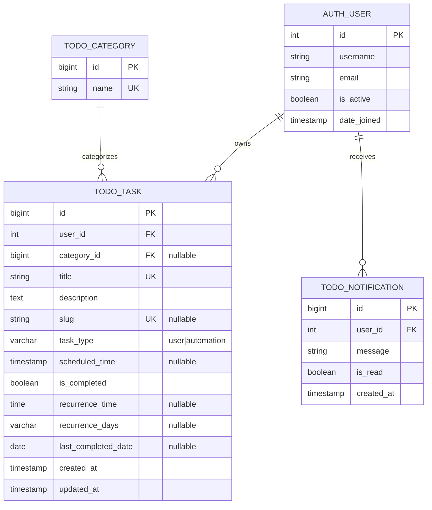

# Database Entity-Relationship Diagram (ERD)

## Mermaid ER Diagram



## Relationship Details

### AUTH_USER → TODO_TASK
- **Cardinality**: One-to-Many (1:N)
- **Foreign Key**: user_id in TODO_TASK
- **Delete Rule**: CASCADE (delete user → delete all tasks)
- **Nullable**: NO
- **Description**: Each task must belong to exactly one user; one user can have many tasks

### AUTH_USER → TODO_NOTIFICATION  
- **Cardinality**: One-to-Many (1:N)
- **Foreign Key**: user_id in TODO_NOTIFICATION
- **Delete Rule**: CASCADE (delete user → delete all notifications)
- **Nullable**: NO
- **Description**: Each notification belong to one user; one user can receive many notifications

### TODO_CATEGORY → TODO_TASK
- **Cardinality**: One-to-Many (1:N)
- **Foreign Key**: category_id in TODO_TASK
- **Delete Rule**: SET NULL (delete category → set task's category to NULL)
- **Nullable**: YES
- **Description**: Category is optional; one category can contain many tasks

## Attribute Key Definitions

- **PK** = Primary Key (unique identifier for the table)
- **FK** = Foreign Key (references another table's primary key)
- **UK** = Unique Key (values must be unique within the column)
- **nullable** = Column can contain NULL values
- **Default** = Default value if not specified on insert

## Table Summary

| Table | Purpose | Records | Key Fields |
|-------|---------|---------|-----------|
| auth_user | Django user accounts | Multiple | id, username, email |
| todo_category | Task categories | ~5-20 | id, name |
| todo_task | User and automation tasks | Hundreds to thousands | id, user_id, title, task_type |
| todo_notification | User notifications | Thousands+ | id, user_id, is_read |

## Visual Relationship Map

```
┌──────────────────────────────┐
│         AUTH_USER            │
│  (Django Authentication)     │
├──────────────────────────────┤
│ id (PK)                      │
│ username                     │
│ email                        │
│ is_active                    │
│ date_joined                  │
└──────┬─────────────┬──────────┘
       │             │
       │ 1:N         │ 1:N
       │             │
   ┌───▼──────────┐  └──────┬──────────────────┐
   │ TODO_TASK    │         │ TODO_NOTIFICATION│
   ├──────────────┤         ├───────────────────┤
   │ id (PK)      │         │ id (PK)          │
   │ user_id (FK) ◄─────────│ user_id (FK) ◄──┐
   │ category_id  │         │ message          │
   │ title        │         │ is_read          │
   │ description  │         │ created_at       │
   │ slug         │         └──────────────────┘
   │ task_type    │
   │ scheduled    │
   │ is_completed │
   │ recurrence_* │
   │ created_at   │
   │ updated_at   │
   └──────┬───────┘
          │ M:1
          │
   ┌──────▼──────────────┐
   │ TODO_CATEGORY       │
   ├─────────────────────┤
   │ id (PK)             │
   │ name (UK)           │
   └─────────────────────┘
```

## Data Flow

```
User Login (auth_user)
    ↓
Create Task (todo_task) ← Select Category (todo_category)
    ↓
System Generates ← Task completion triggers notification
    ↓
Notification (todo_notification)
```

## Normalization Level

- **1NF (First Normal Form)**: ✓ All attributes are atomic
- **2NF (Second Normal Form)**: ✓ No partial dependencies on composite keys (no composite PKs)
- **3NF (Third Normal Form)**: ✓ No transitive dependencies
- **BCNF (Boyce-Codd Normal Form)**: ✓ All determinants are candidate keys

The schema is normalized to 3NF, ensuring data integrity and minimizing redundancy.

## Constraints Summary

| Table | Constraint Type | Columns | Purpose |
|-------|-----------------|---------|---------|
| TODO_TASK | PRIMARY KEY | id | Unique identifier |
| TODO_TASK | FOREIGN KEY | user_id | Link to user (CASCADE delete) |
| TODO_TASK | FOREIGN KEY | category_id | Link to category (SET NULL delete) |
| TODO_TASK | UNIQUE | title | Prevent duplicate task titles |
| TODO_TASK | UNIQUE | slug | URL-safe identifier |
| TODO_CATEGORY | PRIMARY KEY | id | Unique identifier |
| TODO_CATEGORY | UNIQUE | name | Prevent duplicate categories |
| TODO_NOTIFICATION | PRIMARY KEY | id | Unique identifier |
| TODO_NOTIFICATION | FOREIGN KEY | user_id | Link to user (CASCADE delete) |

## Index Strategy

### Performance Indexes
- **Foreign Keys**: Automatic indexes on user_id fields for JOIN performance
- **Unique Constraints**: Indexes on title and slug for fast lookups
- **LIKE Searches**: Varchar pattern operator indexes for text search

### Query Optimization
- Find user tasks: Index on (user_id)
- Find tasks by category: Index on (category_id)
- Search by title/slug: Indexes on (title), (slug)
- Get notifications: Index on (user_id)
- Check task completion: Index on (is_completed)

---

This database design supports a multi-user task management system with support for both one-time user tasks and recurring automation tasks.
