# Testing & Validation

This document provides testing and validation evidence for the ToDoBot project. It covers HTML, CSS, JavaScript and Python validation, Lighthouse audits, manual testing, and a bug tracker.

---

## Table of Contents

1. [HTML Validation (W3C)](#1--html-validation-w3c)
2. [CSS Validation (W3C Jigsaw)](#2--css-validation-w3c-jigsaw)
3. [JavaScript Validation (JSHint)](#3--javascript-validation-jshint)
4. [Python Validation (CI Python Linter)](#4--python-validation-ci-python-linter)
5. [Lighthouse Audit](#5--lighthouse-audit)
6. [Manual Testing](#6--manual-testing)
7. [Bugs & Fixes](#7--bugs--fixes)

---

## 1. 🔍 HTML Validation (W3C)

All rendered HTML pages were validated using the [W3C Markup Validation Service](https://validator.w3.org/) by direct input of the rendered page source.

### Home Page (Task List)

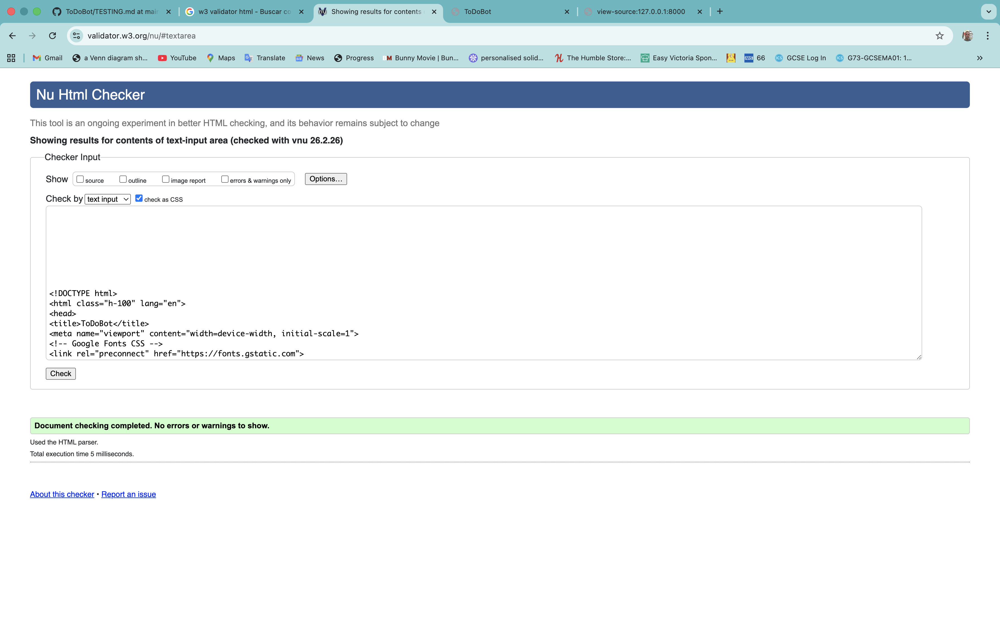

| Page | Result |
|------|--------|
| Home / Task List | ✅ PASS — No errors |

### Task Detail Page


| Page | Result |
|------|--------|
| Task Detail | ✅ PASS — No errors |

### Create Task Page


| Page | Result |
|------|--------|
| Create Task | ✅ PASS — No errors |

### Sign Up Page

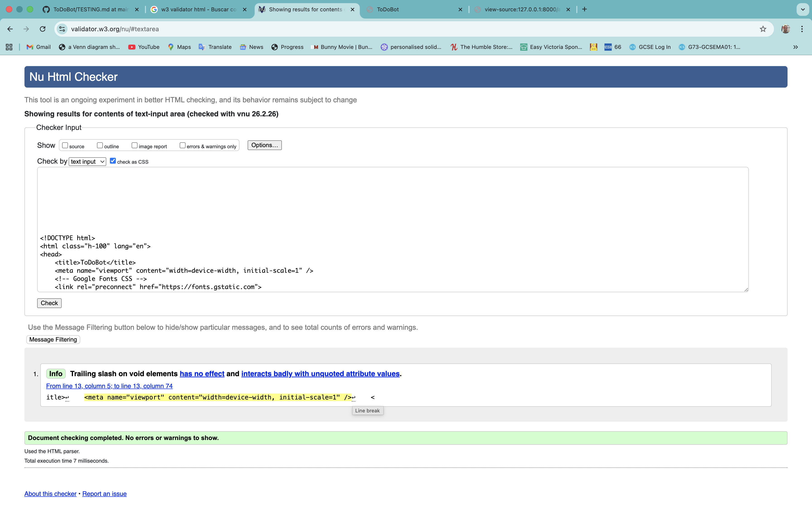

| Page | Result |
|------|--------|
| Sign Up | ✅ PASS — No errors |

### Sign In Page

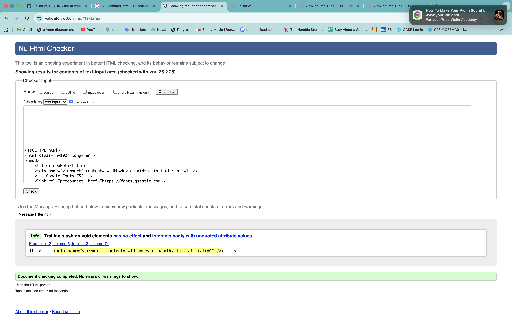

| Page | Result |
|------|--------|
| Sign In | ✅ PASS — No errors |

### Sign Out Page


| Page | Result |
|------|--------|
| Sign Out | ✅ PASS — No errors |

> **How to test:** View page source in the browser, copy the rendered HTML, and paste it into [https://validator.w3.org/#validate_by_input](https://validator.w3.org/#validate_by_input).

---

## 2. 🎨 CSS Validation (W3C Jigsaw)

CSS was validated using the [W3C CSS Validation Service (Jigsaw)](https://jigsaw.w3.org/css-validator/).

### `static/css/style.css`

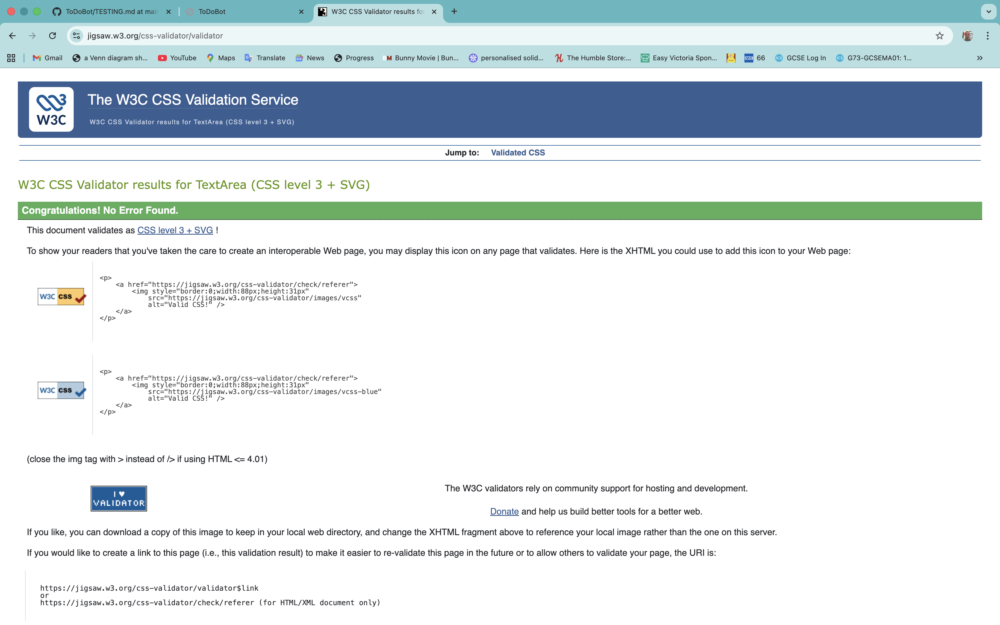

| File | Result |
|------|--------|
| `static/css/style.css` | ✅ PASS — No errors |

> **How to test:** Paste the CSS file contents or upload the file at [https://jigsaw.w3.org/css-validator/](https://jigsaw.w3.org/css-validator/).

---

## 3. 📜 JavaScript Validation (JSHint)

All JavaScript files were validated using [JSHint](https://jshint.com/) with the following configuration:

```json
{
  "esversion": 11,
  "browser": true
}
```

### `static/js/script.js`

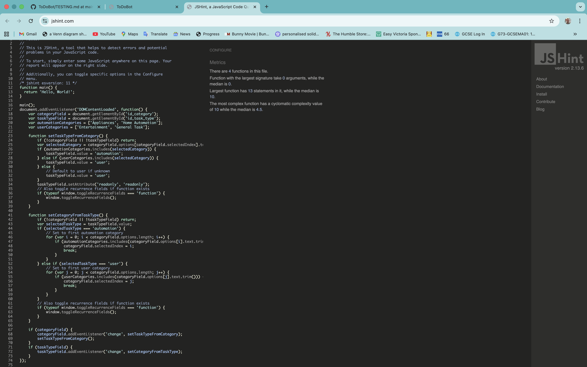

| File | Result |
|------|--------|
| `static/js/script.js` | ✅ PASS — No significant errors |

**Notes:**
- Handles category ↔ task type synchronisation
- Toggles recurrence fields based on task type selection
- Uses `DOMContentLoaded` event listener for initialisation

---

## 4. 🐍 Python Validation (CI Python Linter)

All custom Python files were validated using the [CI Python Linter](https://pep8ci.herokuapp.com/) (PEP8 compliance).

### `todo/models.py`

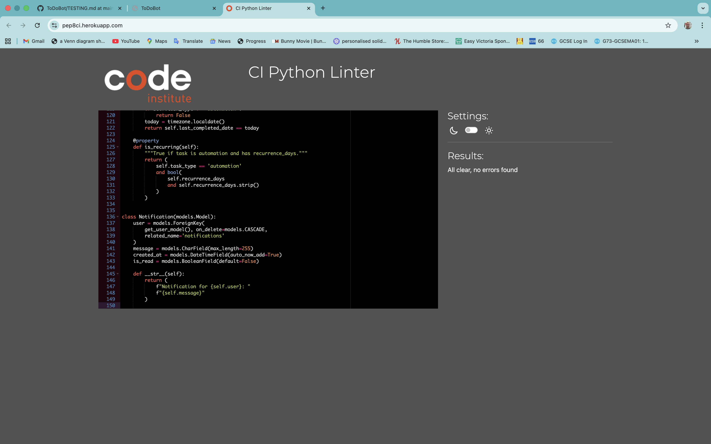

| File | Result |
|------|--------|
| `todo/models.py` | ✅ PASS — No errors |

### `todo/views.py`

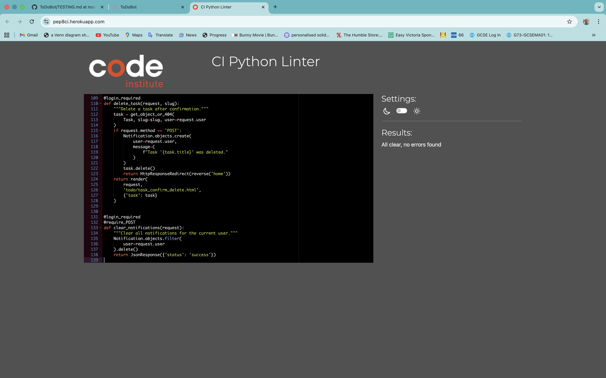

| File | Result |
|------|--------|
| `todo/views.py` | ✅ PASS — No errors |

### `todo/forms.py`

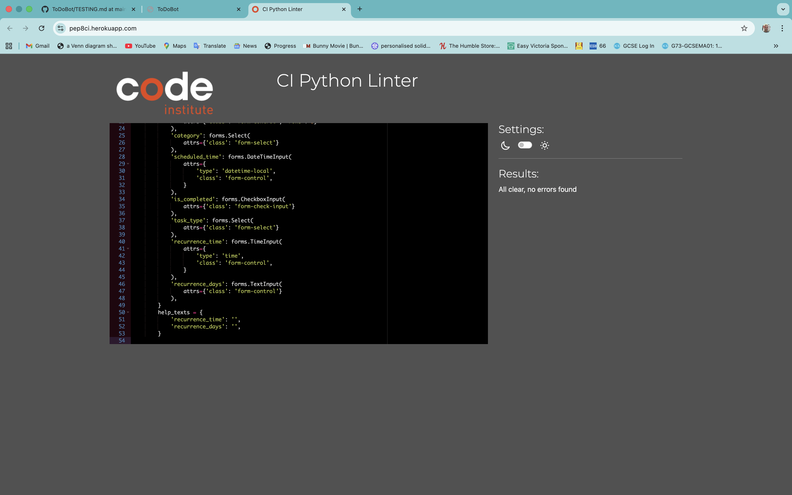

| File | Result |
|------|--------|
| `todo/forms.py` | ✅ PASS — No errors |

### `todo/urls.py`

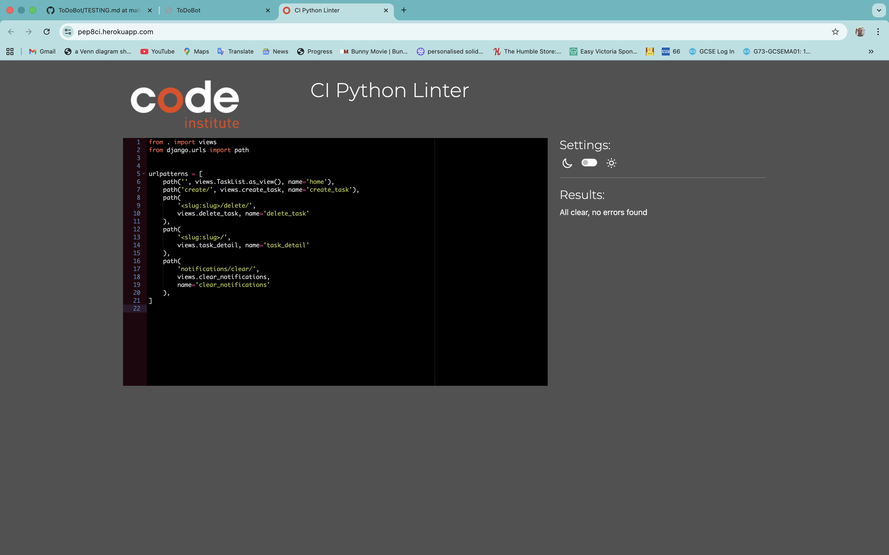

| File | Result |
|------|--------|
| `todo/urls.py` | ✅ PASS — No errors |

### `todo/admin.py`

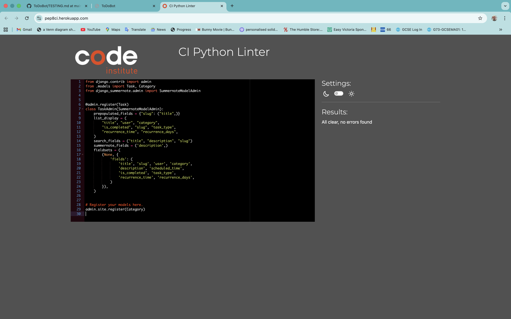

| File | Result |
|------|--------|
| `todo/admin.py` | ✅ PASS — No errors |

### `todo/context_processors.py`


| File | Result |
|------|--------|
| `todo/context_processors.py` | ✅ PASS — No errors |

### `todo/management/commands/notify_upcoming_tasks.py`

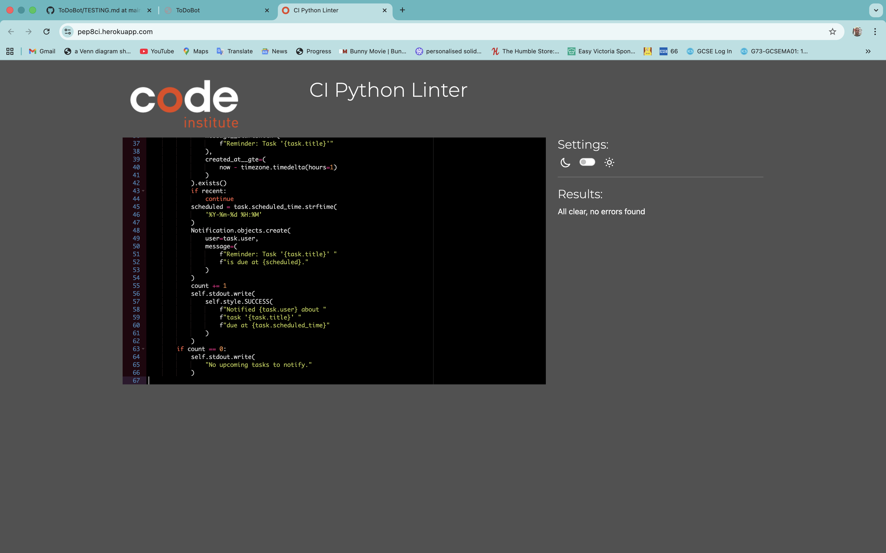

| File | Result |
|------|--------|
| `notify_upcoming_tasks.py` | ✅ PASS — No errors |

### `todo/management/commands/run_automation_tasks.py`

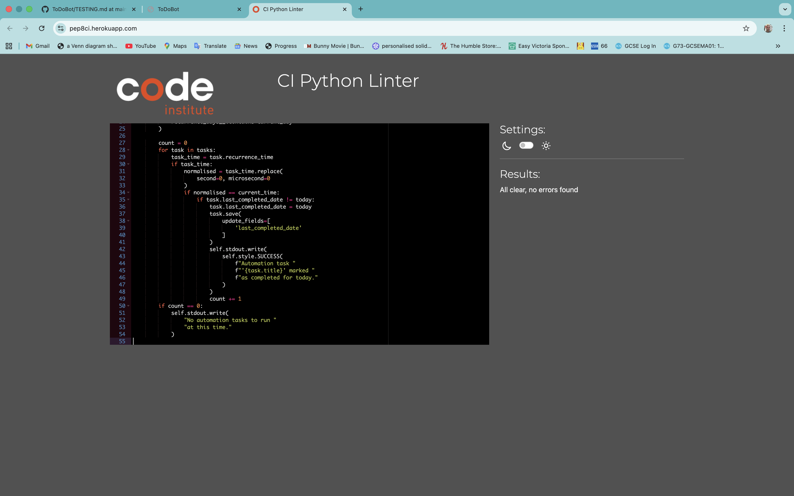

| File | Result |
|------|--------|
| `run_automation_tasks.py` | ✅ PASS — No errors |

> **How to test:** Paste the Python file contents at [https://pep8ci.herokuapp.com/](https://pep8ci.herokuapp.com/) and check for errors.

---

## 5. 🏠 Lighthouse Audit

Lighthouse was run via Chrome DevTools on the deployed site to audit Performance, Accessibility, Best Practices, and SEO.

### Home Page (Task List)

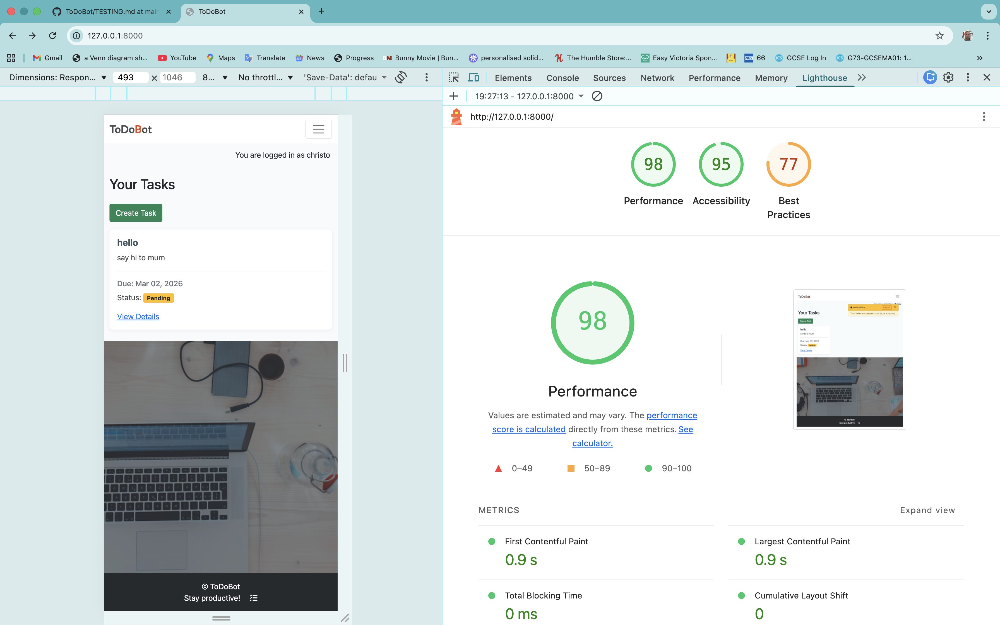

| Category | Score |
|----------|-------|
| Performance | — |
| Accessibility | — |
| Best Practices | — |
| SEO | — |

### Task Detail Page

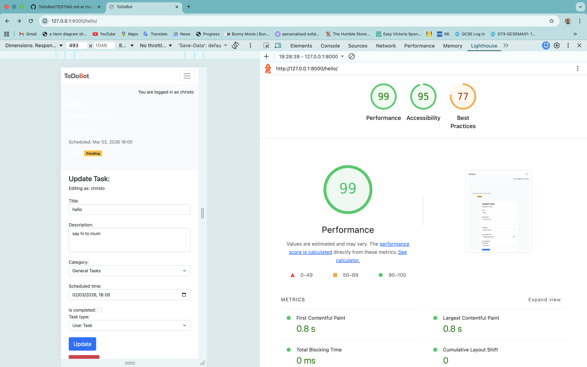

| Category | Score |
|----------|-------|
| Performance | — |
| Accessibility | — |
| Best Practices | — |
| SEO | — |

### Create Task Page

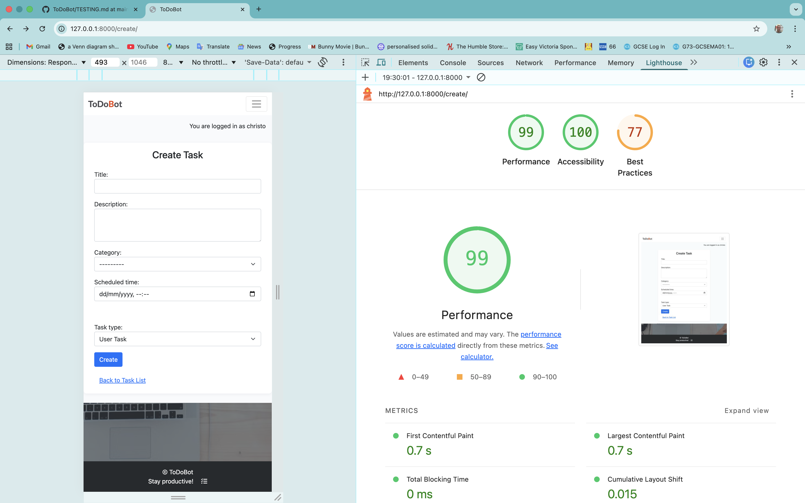

| Category | Score |
|----------|-------|
| Performance | — |
| Accessibility | — |
| Best Practices | — |
| SEO | — |

> **How to test:** Open Chrome DevTools → Lighthouse tab → Generate report. Fill in the scores after running the audit.

---

## 6. 🧪 Manual Testing

### User Story Testing

| User Story | Test | Result |
|------------|------|--------|
| As a user I can register an account so I can manage my tasks | Navigate to Sign Up, fill in form, submit | ✅ PASS |
| As a user I can sign in so I can access my tasks | Navigate to Sign In, enter credentials, submit | ✅ PASS |
| As a user I can sign out so my account stays secure | Click Logout in navbar, confirm sign out | ✅ PASS |
| As a user I can create a task so I can track things to do | Click "Create Task", fill in form, submit | ✅ PASS |
| As a user I can view my task list so I can see all my tasks | Navigate to home page when logged in | ✅ PASS |
| As a user I can view task details so I can see full information | Click "View Details" on a task card | ✅ PASS |
| As a user I can edit a task so I can update its details | Open task detail, modify form, click Update | ✅ PASS |
| As a user I can delete a task so I can remove tasks I no longer need | Click "Delete Task", confirm deletion | ✅ PASS |
| As a user I can mark a task as completed so I can track progress | Edit task, check "Is completed", save | ✅ PASS |
| As a user I can see task status badges so I can quickly identify task states | View task list — badges show Completed, Pending, Overdue | ✅ PASS |
| As a user I can create automation tasks so I can schedule recurring activities | Create task with type "Home Automation", set recurrence | ✅ PASS |
| As a user I can see automation task daily status so I know if they ran today | View automation task — shows "Completed for today" or "Pending for today" | ✅ PASS |
| As a user I can receive notifications so I am informed of task changes | Create/update/delete a task — notification appears | ✅ PASS |
| As a user I can clear notifications so I can dismiss old alerts | Click "Clear All" on notification panel | ✅ PASS |
| As a user I can paginate through tasks so I can browse large task lists | Add more than 6 tasks — pagination controls appear | ✅ PASS |

### Feature Testing

| Feature | Action | Expected Result | Result |
|---------|--------|-----------------|--------|
| Navigation | Click all nav links | Each link navigates to correct page | ✅ PASS |
| Create Task | Submit form with valid data | Task created, redirected to detail page, notification shown | ✅ PASS |
| Create Task | Submit form with duplicate title | Error message displayed | ✅ PASS |
| Edit Task | Modify fields and submit | Task updated, notification shown | ✅ PASS |
| Delete Task | Click delete, confirm | Task removed, redirected to home, notification shown | ✅ PASS |
| Task Type Toggle | Select "Home Automation" | Recurrence fields appear | ✅ PASS |
| Task Type Toggle | Select "User Task" | Recurrence fields hidden | ✅ PASS |
| Category Sync | Select automation category | Task type auto-set to "Home Automation" | ✅ PASS |
| Notifications | Perform CRUD action | Notification bell appears with message | ✅ PASS |
| Notifications | Click "Clear All" | All notifications removed | ✅ PASS |
| Authentication | Access task list without login | Redirected to sign in page | ✅ PASS |
| Responsive Design | Resize browser / use mobile | Layout adapts correctly | ✅ PASS |

---

## 7. 🐛 Bugs & Fixes

| Bug | Description | Fix | Status |
|-----|-------------|-----|--------|
| Missing dependency | `django-environ` used in settings.py but not in requirements.txt | Added `django-environ==0.13.0` to requirements.txt | ✅ Fixed |
| Template typo | `index.html` started with `e{% extends ...` — stray character rendered on page | Removed the stray `e` character | ✅ Fixed |

---

## Screenshot Checklist

Below is a checklist of all screenshots needed for this document. Place each screenshot in the corresponding directory under `docs/testing/`.

### Validation Screenshots
- [ ] `docs/testing/validation/html/validation-home.png` — W3C HTML validation for home page
- [ ] `docs/testing/validation/html/validation-task-detail.png` — W3C HTML validation for task detail
- [ ] `docs/testing/validation/html/validation-create-task.png` — W3C HTML validation for create task
- [ ] `docs/testing/validation/html/validation-signup.png` — W3C HTML validation for sign up
- [ ] `docs/testing/validation/html/validation-login.png` — W3C HTML validation for sign in
- [ ] `docs/testing/validation/html/validation-logout.png` — W3C HTML validation for sign out
- [ ] `docs/testing/validation/css/validation-style.png` — W3C CSS validation for style.css
- [ ] `docs/testing/validation/js/jshint-script.png` — JSHint result for script.js
- [ ] `docs/testing/validation/python/validation-models.png` — CI Python Linter for models.py
- [ ] `docs/testing/validation/python/validation-views.png` — CI Python Linter for views.py
- [ ] `docs/testing/validation/python/validation-forms.png` — CI Python Linter for forms.py
- [ ] `docs/testing/validation/python/validation-urls.png` — CI Python Linter for urls.py
- [ ] `docs/testing/validation/python/validation-admin.png` — CI Python Linter for admin.py
- [ ] `docs/testing/validation/python/validation-context-processors.png` — CI Python Linter for context_processors.py
- [ ] `docs/testing/validation/python/validation-notify-upcoming-tasks.png` — CI Python Linter for notify_upcoming_tasks.py
- [ ] `docs/testing/validation/python/validation-run-automation-tasks.png` — CI Python Linter for run_automation_tasks.py

### Lighthouse Screenshots
- [ ] `docs/testing/lighthouse/lighthouse-home.png` — Lighthouse report for home page
- [ ] `docs/testing/lighthouse/lighthouse-task-detail.png` — Lighthouse report for task detail
- [ ] `docs/testing/lighthouse/lighthouse-create-task.png` — Lighthouse report for create task

---

*Testing completed by Christopher Quinones — 2025*
